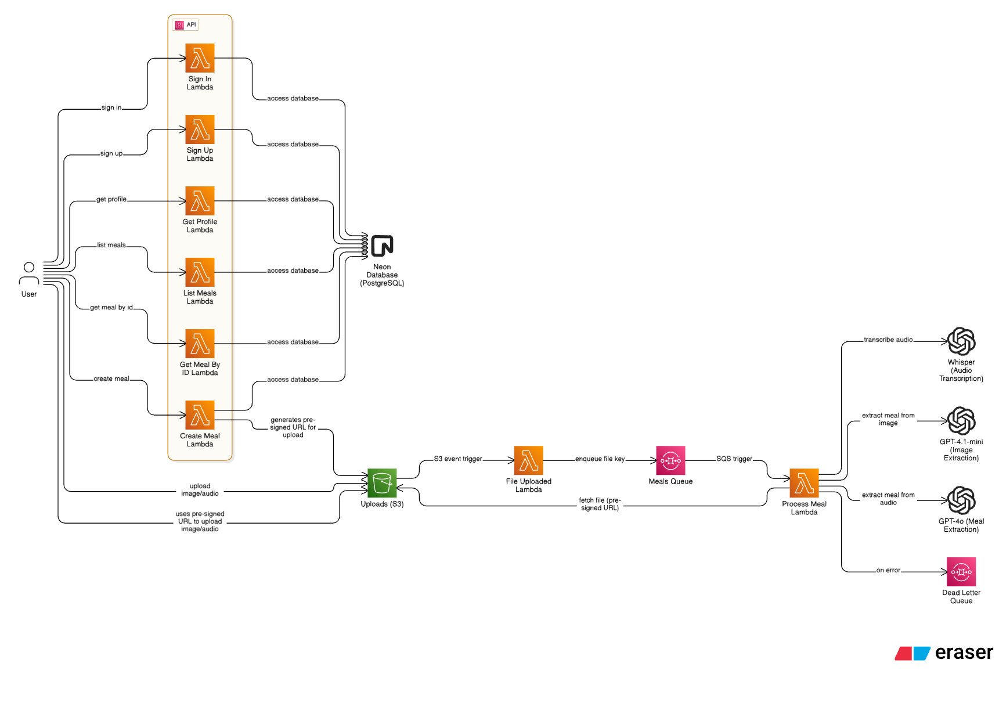

# 🥦 Foodiary AI


## 📖 Sobre o Projeto

O **Foodiary** é uma aplicação inovadora de registro e análise nutricional de refeições que permite aos usuários documentar suas refeições através de **fotos** ou **gravações de áudio**. Utilizando inteligência artificial avançada da OpenAI, a aplicação automaticamente identifica os alimentos, calcula as informações nutricionais e oferece insights detalhados sobre o consumo alimentar.

### 🎯 Principais Funcionalidades

- 📸 **Registro por Imagem**: Tire uma foto da sua refeição e receba análise nutricional completa
- 🎙️ **Registro por Áudio**: Descreva sua refeição por voz e obtenha as informações nutricionais
- 🤖 **IA Avançada**: Processamento inteligente com GPT-4o e Whisper da OpenAI
- 📊 **Análise Nutricional**: Cálculo automático de calorias, carboidratos, proteínas e gorduras
- ☁️ **Processamento Serverless**: Arquitetura escalável na AWS
- 📱 **Mobile First**: Aplicativo React Native otimizado para dispositivos móveis

## 🏗️ Arquitetura



### Fluxo de Funcionamento

1. **📱 Upload**: Usuário envia foto/áudio através do app React Native
2. **🔗 URL Pré-assinada**: API gera URL pré-assinada do S3 para upload seguro
3. **☁️ Armazenamento**: Arquivo é enviado diretamente para o bucket S3
4. **⚡ Evento S3**: Upload dispara evento que adiciona o arquivo na fila SQS
5. **🔄 Processamento**: Lambda consome a fila e processa o arquivo com OpenAI
6. **💾 Persistência**: Dados nutricionais são salvos no banco de dados
7. **📊 Visualização**: Usuário visualiza os resultados no aplicativo

### Componentes Principais

- **Frontend**: React Native com Expo
- **Backend**: Node.js com Serverless Framework
- **Storage**: Amazon S3 para arquivos de mídia
- **Queue**: Amazon SQS para processamento assíncrono
- **Database**: Neon PostgreSQL com Drizzle ORM
- **IA**: OpenAI GPT-4o e Whisper para análise
- **Deploy**: AWS Lambda Functions

## 🚀 Tecnologias Utilizadas

### Frontend (React Native)
- **React Native** com Expo SDK 53
- **TypeScript** para tipagem estática
- **TailwindCSS** com NativeWind para estilização
- **React Query** para gerenciamento de estado
- **React Hook Form** para formulários
- **Expo Router** para navegação
- **Axios** para requisições HTTP

### Backend (Node.js Serverless)
- **Node.js 22.x** com TypeScript
- **Serverless Framework** para deploy na AWS
- **Drizzle ORM** para interação com banco de dados
- **AWS SDK** para integração com serviços AWS
- **OpenAI SDK** para processamento de IA
- **Zod** para validação de dados
- **JWT** para autenticação

### Infraestrutura AWS
- **Lambda Functions** para lógica de negócio
- **S3 Bucket** para armazenamento de arquivos
- **SQS Queue** para processamento assíncrono
- **API Gateway** para endpoints REST
- **Dead Letter Queue** para tratamento de erros

## 📁 Estrutura do Projeto

```
foodiary-ai/
├── foodiary/                 # 📱 Aplicativo React Native
│   ├── src/
│   │   ├── contexts/         # Contextos React (Auth, etc.)
│   │   ├── hooks/           # Custom hooks
│   │   ├── services/        # Serviços e APIs
│   │   └── components/      # Componentes reutilizáveis
│   ├── app.json
│   ├── package.json
│   └── tailwind.config.js
├── foodiary-api/            # ⚡ Backend Serverless
│   ├── src/
│   │   ├── functions/       # Funções Lambda
│   │   ├── services/        # Serviços (IA, Database)
│   │   └── types/          # Tipos TypeScript
│   ├── serverless.yml      # Configuração Serverless
│   ├── drizzle.config.ts   # Configuração do ORM
│   └── package.json
└── assets/                 # 🖼️ Imagens e recursos
    ├── foodiary-main-mockup.png
    └── arch-diagram-light.png
```

## ⚙️ Configuração do Ambiente

### Pré-requisitos

- **Node.js** (versão 22 ou superior)
- **npm** ou **yarn**
- **Expo CLI**: `npm install -g @expo/cli`
- **Serverless Framework**: `npm install -g serverless`
- **Conta AWS** configurada
- **Conta OpenAI** com API Key

### Variáveis de Ambiente

#### Backend (foodiary-api)
Crie um arquivo `.env` na pasta `foodiary-api/`:

```env
# Banco de Dados
DATABASE_URL=your_neon_database_url

# JWT
JWT_SECRET=your_jwt_secret_key

# OpenAI
OPENAI_API_KEY=your_openai_api_key
```

### 🛠️ Instalação e Execução Local

#### 1. Clone o Repositório
```bash
git clone <repository-url>
cd foodiary-project
```

#### 2. Configuração do Backend

```bash
# Navegue para o diretório da API
cd foodiary-api

# Instale as dependências
npm install

# Configure as variáveis de ambiente
cp .env.example .env
# Edite o arquivo .env com suas credenciais

# Execute localmente com Serverless Offline
npm run dev
```

#### 3. Configuração do Frontend

```bash
# Em outro terminal, navegue para o diretório do app
cd foodiary

# Instale as dependências
npm install

# Inicie o servidor de desenvolvimento
npm start
```

#### 4. Executando no Dispositivo

- **Android**: Execute `npm run android` ou escaneie o QR code com o app Expo Go
- **iOS**: Execute `npm run ios` ou escaneie o QR code com o app Expo Go
- **Web**: Execute `npm run web` para versão web de desenvolvimento

## 🚀 Deploy em Produção

### Deploy do Backend

```bash
cd foodiary-api

# Configure suas credenciais AWS
aws configure

# Deploy para produção
sls deploy --stage prod
```

### Deploy do Frontend

```bash
cd foodiary

# Build para produção
expo build:android  # Para Android
expo build:ios      # Para iOS
```

## 🧪 Funcionalidades Principais

### 📸 Análise de Imagens
- Upload de fotos das refeições
- Identificação automática de alimentos
- Estimativa de porções e quantidades
- Cálculo nutricional preciso

### 🎙️ Processamento de Áudio
- Gravação de descrições das refeições
- Transcrição com Whisper AI
- Extração de dados nutricionais do texto
- Suporte para português brasileiro

### 👤 Gestão de Usuários
- Sistema de autenticação JWT
- Perfis personalizados com metas nutricionais
- Histórico completo de refeições
- Cálculo de macronutrientes

### ☁️ Processamento Assíncrono
- Fila SQS para processamento escalável
- Dead Letter Queue para tratamento de erros
- Timeout configurável para operações IA
- Retry automático em caso de falha

## 📊 APIs Disponíveis

### Autenticação
- `POST /signin` - Login de usuário
- `POST /signup` - Cadastro de usuário
- `GET /me` - Informações do usuário

### Refeições
- `POST /meals` - Criar nova refeição (retorna URL pré-assinada)
- `GET /meals` - Listar refeições do usuário
- `GET /meals/{mealId}` - Obter detalhes de uma refeição

## 🔧 Monitoramento e Logs

- **CloudWatch Logs** para logs das Lambda functions
- **SQS Metrics** para monitoramento da fila
- **S3 Events** para rastreamento de uploads
- **Dead Letter Queue** para análise de falhas

## 🤝 Contribuição

1. Faça um fork do projeto
2. Crie uma branch para sua feature (`git checkout -b feature/AmazingFeature`)
3. Commit suas mudanças (`git commit -m 'Add some AmazingFeature'`)
4. Push para a branch (`git push origin feature/AmazingFeature`)
5. Abra um Pull Request

---

**Desenvolvido com ❤️ usando React Native + Serverless Framework + OpenAI**